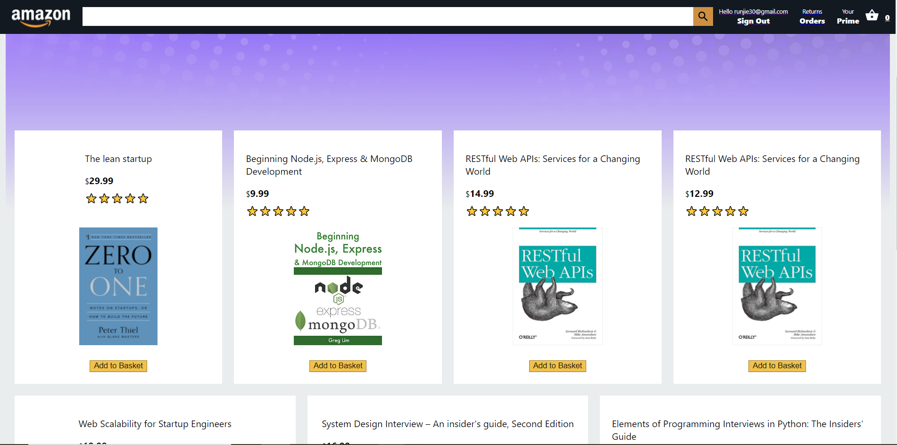

# Amazon Clone
> Developed a full-stack Amazon clone with React.
> Live demo [_here_](https://clone-4ed58.web.app/). 

## Table of Contents
* [General Info](#general-information)
* [Technologies Used](#technologies-used)
* [Features](#features)
* [Screenshots](#screenshots)
* [Project Status](#project-status)
* [Room for Improvement](#room-for-improvement)
* [Acknowledgements](#acknowledgements)
* [Contact](#contact)
<!-- * [License](#license) -->

## General Information
- What is the purpose of your project?
This project was made for educational purposes and to showcase my React skills.
- Why did you undertake it?
I undertook this project to get a broader understanding of the React ecosystem.

## Technologies Used
- React - version 17.0.2
- Firebase - version 8.9.1
- CSS - version 2.1

## Features
List the ready features here:
- Add to cart.
- Stripe payments.
- Profiles creation.

## Screenshots

<!-- If you have screenshots you'd like to share, include them here. -->

## Project Status
Project is already complete. Although I will be adding more features in the feature.

## Room for Improvement
We could add a backend to the current system, there can also be a place where you can choose to either be a seller or a buyer and the seller could have the ability to add items

Room for improvement:
- CSS could be improved in some parts like the sign in page. 
- Shopping basket could be improved to look more like Amazon.

To do:
- Backend system with MongoDB.
- Seller accounts with the ability to add items. 

## Acknowledgements
Credits
- This project was based on [this tutorial](https://www.youtube.com/watch?v=RDV3Z1KCBvo&t=10s).

## Contact
Created by [@arstix] - feel free to contact me!

<!-- Optional -->
<!-- ## License -->
<!-- This project is open source and available under the [... License](). -->

<!-- You don't have to include all sections - just the one's relevant to your project -->
